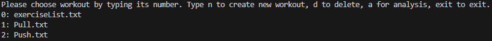
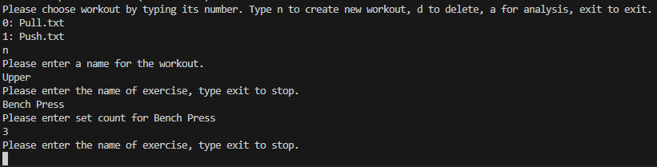
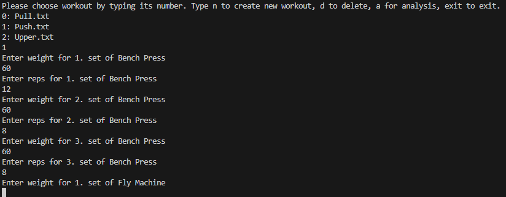
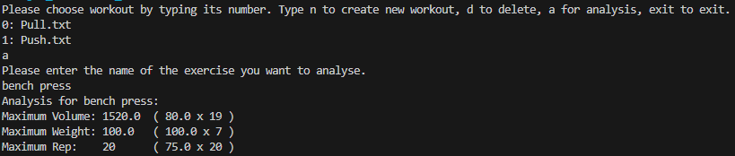

# Workout Tracker & Analyzer on Java

This is a simple console-based application I built to track my gym workouts and analyze my progress. I wanted to create a system that stores data locally without needing an SQL database, so it manages everything using text files.

## What it does?
* **Create Workouts:** You can define new routines and add exercises to them.
* **Log Sets:** Records weight, reps, and set counts for every exercise.
* **Save History:** Everything is saved into `history.txt` so you don't lose your data when you close the app.
* **Analysis Mode:** It reads your history and calculates your **Max Weight (PR)**, **Max Reps**, and **Max Volume** for any specific exercise.

## Example Data Structure
The app saves data in a format like this inside history.txt:

```
WoNumber1
Bench Press,60.0x12,60.0x12,80.0x5
Lat Pulldown,50.0x10,50.0x10
Squat,100.0x5,100.0x5
```

## TO-DO
* Add muscle groups for exercises and track how many sets have done for each muscle last week.
* Add a GUI instead of console app.
* Add delete workout method.


## Screenshots





